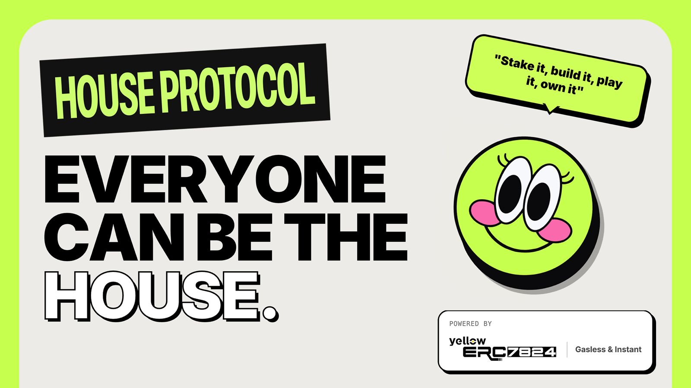

<p align="center">
  
</p>

<h1 align="center">House Protocol</h1>

<p align="center"><strong>Anyone can be the house.</strong></p>

<p align="center">
  <a href="https://house-protocol.kwek.dev/">Try it live</a>
</p>

---

House Protocol turns liquidity providers into the house. LPs deposit into an ERC4626 vault and earn yield as their capital backs the house side of betting games. Developers tap into that liquidity through an SDK to build fast, gasless betting experiences. Players enjoy instant bets with provably fair outcomes, verified on-chain through commit-reveal.

All gameplay runs off-chain via [Yellow Network's](https://yellow.org) Nitrolite state channels -- bets resolve instantly without gas fees. Only deposits and withdrawals hit the chain.

Three roles, one protocol: **Stake it. Build it. Play it. Own it.**

## Contract Addresses (Sepolia)

| Contract | Address |
|----------|---------|
| HouseVault | [`0x4ce1DE2054da21DB659a90E04aee1f599e3027cE`](https://sepolia.etherscan.io/address/0x4ce1DE2054da21DB659a90E04aee1f599e3027cE) |
| USDH Token | [`0x25FfCCE632a03898c2ecB0EF9bb6a86177a363Ed`](https://sepolia.etherscan.io/address/0x25FfCCE632a03898c2ecB0EF9bb6a86177a363Ed) |
| HouseSession | [`0x7D962Cf03d2a6EedeB04DB588D9286972C3ABa9D`](https://sepolia.etherscan.io/address/0x84C550AED2e1ed5376F8c83bFDE39851ec51f5bC) |
| Nitrolite Custody | [`0xEC94b4039237ac9490377FDB8A65e884eD6154A0`](https://sepolia.etherscan.io/address/0xEC94b4039237ac9490377FDB8A65e884eD6154A0) |

## How It Works

```
            DEPOSIT                    OFF-CHAIN GAMES               SETTLE
 ┌──────┐  USDH   ┌────────────┐     ┌──────────────────┐     ┌──────────────┐
 │  LP  │ ──────→ │ HouseVault │ ──→ │ Nitrolite State  │ ──→ │  On-chain    │
 └──────┘ ←────── │  (ERC4626) │     │    Channels      │     │  Settlement  │
          sUSDH   └────────────┘     │                  │     └──────────────┘
                        │            │  Player ←→ House │
                        ▼            │  Signed states   │
                  ┌──────────┐       │  Instant bets    │
                  │ Nitrolite│       └──────────────────┘
                  │ Custody  │              │
                  └──────────┘              ▼
                                    ┌───────────────┐
                                    │ HouseSession  │
                                    │ Commit-Reveal │
                                    │ Verification  │
                                    └───────────────┘
```

1. **LPs deposit USDH** into the HouseVault and receive sUSDH shares. Deposited funds are automatically forwarded into Nitrolite's on-chain Custody contract -- no idle capital.
2. **Players open state channels** with the house operator via Nitrolite. Bets resolve through signed state updates off-chain, with zero gas during gameplay.
3. **Provably fair outcomes** are guaranteed through commit-reveal on the HouseSession contract. The house commits a hashed seed before the game, so users can verify the randomness afterwards.
4. **LPs earn yield** as the house edge accumulates. Share value (sUSDH) increases over time as the vault's total assets grow.

## How to Play

1. **Connect wallet** -- sign in through Privy (supports social login and wallet connect)
2. **Get USDH** -- mint testnet USDH tokens on Sepolia
3. **Deposit to custody** -- deposit USDH into the Nitrolite custody contract
4. **Play games** -- place bets instantly through state channels, no gas per bet
5. **Withdraw** -- withdraw your balance back to your wallet anytime

## Staking (For LPs)

Earn yield by providing liquidity to the house.

1. **Approve USDH** -- approve the HouseVault contract to spend your USDH
2. **Deposit** -- call `vault.deposit(amount, receiver)` to deposit USDH and receive sUSDH shares
3. **Earn** -- your sUSDH shares appreciate as the house generates revenue from games
4. **Redeem** -- call `vault.redeem(shares, receiver, owner)` to burn sUSDH and withdraw USDH at the current exchange rate

The vault follows the [ERC4626](https://eips.ethereum.org/EIPS/eip-4626) tokenized vault standard. Share price is determined by `totalAssets / totalSupply`, where total assets includes both idle vault balance and funds deployed in Nitrolite custody.

## For Developers

Build betting games on top of House Protocol without managing bankroll or settlement infrastructure.

### Architecture

The protocol provides:

- **Liquidity** -- the HouseVault supplies bankroll, so developers don't need to source their own
- **State channels** -- Nitrolite handles off-chain session management, co-signing, and settlement
- **Provable fairness** -- HouseSession provides on-chain commit-reveal verification that players can audit

### Integration Flow

1. Open an app session with the house operator via Nitrolite SDK (`@erc7824/nitrolite`)
2. Use the commit-reveal flow on HouseSession for verifiable randomness
3. Resolve game outcomes through signed state updates
4. Final settlement happens on-chain automatically via Nitrolite

## Project Structure

```
house-protocol/
├── contract/                   # Solidity smart contracts (Foundry)
│   ├── src/
│   │   ├── HouseVault.sol      # ERC4626 vault for LP deposits
│   │   ├── HouseSession.sol    # Commit-reveal provable fairness
│   │   ├── MintableERC20.sol   # Test token (USDH)
│   │   └── interfaces/
│   │       └── ICustody.sol    # Nitrolite custody interface
│   ├── script/                 # Deployment scripts
│   └── test/                   # Contract tests
├── web/                        # React + Vite frontend
├── backend/                    # Node.js backend (Prisma + PostgreSQL)
└── explorations/yellow-test    # Yellow Protocol - Nitrolite exploration
```

## How It's Made

We [self-hosted a **Nitrolite Clearnode**](https://nitrolite-scanner.kwek.dev/) because Yellow Protocol's public Sepolia Clearnode had limited token support and their scanner stopped updating. 

- **Smart Contracts** -- Foundry. HouseVault extends ERC4626 (OpenZeppelin) with an overridden `_deposit` hook that auto-forwards funds into Nitrolite Custody. HouseSession handles provably fair verification through commit-reveal.
- **Frontend** -- React + Vite with Privy for wallet auth. All game interactions happen off-chain through state channels.
- **Backend** -- PostgreSQL + Prisma for session management, bet validation, seed storage, and operator co-signing logic.
- **State Channels** -- Nitrolite SDK (`@erc7824/nitrolite`) for auth, sessions, and state management. `viem` for on-chain interactions.

## Development

### Prerequisites

- [Bun](https://bun.sh) v1.1+
- [Foundry](https://book.getfoundry.sh/getting-started/installation)

### Setup

```bash
# install dependencies
bun install

# compile contracts
cd contract && forge build

# run contract tests
forge test

# start frontend
bun run dev:web

# start backend
bun run dev:backend

# start everything
bun run dev

# explore state channel
cd explorations/yellow-test                                                                                      
bun run src/full-flow.ts        # run the full flow end-to-end                                                   
bun run src/check-balance.ts    # check Clearnode balances                                                      
bun run src/mint-usdh.ts        # mint test tokens
```


## License

MIT
